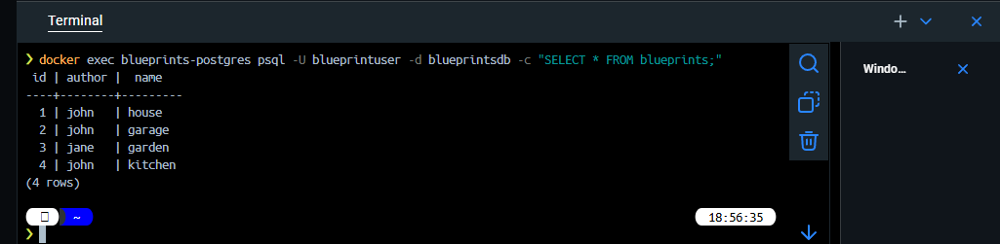
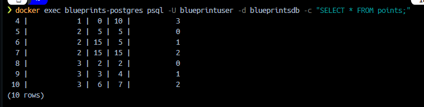
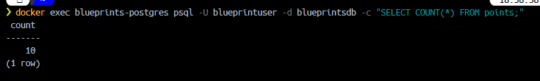

## Laboratorio #4 – REST API Blueprints (Java 21 / Spring Boot 3.3.x)
# Escuela Colombiana de Ingeniería – Arquitecturas de Software  

---

## 📋 Requisitos
- Java 21
- Maven 3.9+

## ▶️ Ejecución del proyecto
```bash
mvn clean install
mvn spring-boot:run
```
Probar con `curl`:
```bash
curl -s http://localhost:8080/blueprints | jq
curl -s http://localhost:8080/blueprints/john | jq
curl -s http://localhost:8080/blueprints/john/house | jq
curl -i -X POST http://localhost:8080/blueprints -H 'Content-Type: application/json' -d '{ "author":"john","name":"kitchen","points":[{"x":1,"y":1},{"x":2,"y":2}] }'
curl -i -X PUT  http://localhost:8080/blueprints/john/kitchen/points -H 'Content-Type: application/json' -d '{ "x":3,"y":3 }'
```

> Si deseas activar filtros de puntos (reducción de redundancia, *undersampling*, etc.), implementa nuevas clases que implementen `BlueprintsFilter` y cámbialas por `IdentityFilter` con `@Primary` o usando configuración de Spring.
---

Abrir en navegador:  
- Swagger UI: [http://localhost:8080/swagger-ui.html](http://localhost:8080/swagger-ui.html)  
- OpenAPI JSON: [http://localhost:8080/v3/api-docs](http://localhost:8080/v3/api-docs)  

---

## 🗂️ Estructura de carpetas (arquitectura)

```
src/main/java/edu/eci/arsw/blueprints
  ├── model/         # Entidades de dominio: Blueprint, Point
  ├── persistence/   # Interfaz + repositorios (InMemory, Postgres)
  │    └── impl/     # Implementaciones concretas
  ├── services/      # Lógica de negocio y orquestación
  ├── filters/       # Filtros de procesamiento (Identity, Redundancy, Undersampling)
  ├── controllers/   # REST Controllers (BlueprintsAPIController)
  └── config/        # Configuración (Swagger/OpenAPI, etc.)
```

> Esta separación sigue el patrón **capas lógicas** (modelo, persistencia, servicios, controladores), facilitando la extensión hacia nuevas tecnologías o fuentes de datos.

---

## 📖 Actividades del laboratorio

### 1. Familiarización con el código base
- Revisa el paquete `model` con las clases `Blueprint` y `Point`.  
- Entiende la capa `persistence` con `InMemoryBlueprintPersistence`.  
- Analiza la capa `services` (`BlueprintsServices`) y el controlador `BlueprintsAPIController`.

### 2. Migración a persistencia en PostgreSQL


#### Archivos de Configuración

**`docker-compose.yml`** - Define el servicio PostgreSQL:
```yaml
services:
  postgres:
    image: postgres:16
    container_name: blueprints-postgres
    environment:
      POSTGRES_DB: blueprintsdb
      POSTGRES_USER: blueprintuser
      POSTGRES_PASSWORD: blueprintpass
    ports:
      - "5432:5432"
    volumes:
      - postgres-data:/var/lib/postgresql/data
      - ./init-db.sql:/docker-entrypoint-initdb.d/init.sql
    healthcheck:
      test: ["CMD-SHELL", "pg_isready -U blueprintuser -d blueprintsdb"]
      interval: 10s
      timeout: 5s
      retries: 5

volumes:
  postgres-data:
```

**`init-db.sql`** - Script de inicialización:
- Crea tabla `blueprints` (id, author, name)
- Crea tabla `points` (id, blueprint_id, x, y, point_order)
- Inserta 4 blueprints de prueba con sus puntos
- Se ejecuta **solo la primera vez.**

**`application.properties`** - Configuración Spring Boot:
```properties
# PostgreSQL
spring.datasource.url=jdbc:postgresql://localhost:5432/blueprintsdb
spring.datasource.username=blueprintuser
spring.datasource.password=blueprintpass

# JPA/Hibernate
spring.jpa.hibernate.ddl-auto=update
spring.jpa.show-sql=true

# Docker Compose automático
spring.docker.compose.enabled=true
spring.docker.compose.lifecycle-management=start_and_stop
```

**`pom.xml`** - Dependencias necesarias:
```xml
<!-- PostgreSQL Driver -->
<dependency>
    <groupId>org.postgresql</groupId>
    <artifactId>postgresql</artifactId>
</dependency>

<!-- Spring Data JPA -->
<dependency>
    <groupId>org.springframework.boot</groupId>
    <artifactId>spring-boot-starter-data-jpa</artifactId>
</dependency>

<!-- Docker Compose Support -->
<dependency>
    <groupId>org.springframework.boot</groupId>
    <artifactId>spring-boot-docker-compose</artifactId>
    <optional>true</optional>
</dependency>
```

#### ¿Cómo funciona?

Cuando ejecutas `mvn spring-boot:run`, Spring Boot automáticamente:

1. **Detecta `docker-compose.yml`** en la raíz del proyecto
2. **Levanta PostgreSQL** con `docker compose up`
3. **Espera a que esté listo**
4. **Ejecuta `init-db.sql`** (solo la primera vez)
5. **Conecta la aplicación** a la base de datos
6. **Detiene PostgreSQL** al cerrar la aplicación

#### Verificar datos en PostgreSQL

```bash
# Consultar blueprints
docker exec blueprints-postgres psql -U blueprintuser -d blueprintsdb -c "SELECT * FROM blueprints;"

# Consultar puntos
docker exec blueprints-postgres psql -U blueprintuser -d blueprintsdb -c "SELECT * FROM points;"

# Contar puntos totales
docker exec blueprints-postgres psql -U blueprintuser -d blueprintsdb -c "SELECT COUNT(*) FROM points;"
```





### 3. Buenas prácticas de API REST
- Cambia el path base de los controladores a `/api/v1/blueprints`.  
- Usa **códigos HTTP** correctos:  
  - `200 OK` (consultas exitosas).  
  - `201 Created` (creación).  
  - `202 Accepted` (actualizaciones).  
  - `400 Bad Request` (datos inválidos).  
  - `404 Not Found` (recurso inexistente).  
- Implementa una clase genérica de respuesta uniforme:
  ```java
  public record ApiResponse<T>(int code, String message, T data) {}
  ```
  Ejemplo JSON:
  ```json
  {
    "code": 200,
    "message": "execute ok",
    "data": { "author": "john", "name": "house", "points": [...] }
  }
  ```

### 4. OpenAPI / Swagger
- Configura `springdoc-openapi` en el proyecto.  
- Expón documentación automática en `/swagger-ui.html`.  
- Anota endpoints con `@Operation` y `@ApiResponse`.

### 5. Filtros de *Blueprints*
- Implementa filtros:
  - **RedundancyFilter**: elimina puntos duplicados consecutivos.  
  - **UndersamplingFilter**: conserva 1 de cada 2 puntos.  
- Activa los filtros mediante perfiles de Spring (`redundancy`, `undersampling`).  

---

## ✅ Entregables

1. Repositorio en GitHub con:  
   - Código fuente actualizado.  
   - Configuración PostgreSQL (`application.yml` o script SQL).  
   - Swagger/OpenAPI habilitado.  
   - Clase `ApiResponse<T>` implementada.  

2. Documentación:  
   - Informe de laboratorio con instrucciones claras.  
   - Evidencia de consultas en Swagger UI y evidencia de mensajes en la base de datos.  
   - Breve explicación de buenas prácticas aplicadas.  

---

## 📊 Criterios de evaluación

| Criterio | Peso |
|----------|------|
| Diseño de API (versionamiento, DTOs, ApiResponse) | 25% |
| Migración a PostgreSQL (repositorio y persistencia correcta) | 25% |
| Uso correcto de códigos HTTP y control de errores | 20% |
| Documentación con OpenAPI/Swagger + README | 15% |
| Pruebas básicas (unitarias o de integración) | 15% |

**Bonus**:  

- Imagen de contenedor (`spring-boot:build-image`).  
- Métricas con Actuator.  